### Manual de Administrador

Este manual proporciona una guía paso a paso para la administración de cuentas de usuario en el panel de Keycloak, incluyendo la creación y deshabilitación de cuentas de administrador.

---

### Creación de Cuentas para Administrador

Para asignar un rol de administrador a un usuario, sigue los pasos a continuación:

1. **Acceso al Panel de Keycloak**  
   Primero, asegúrate de tener las credenciales necesarias (usuario y contraseña) para acceder al panel de Keycloak. Una vez que tengas las credenciales, ingresa a la consola de administración de Keycloak. [http://auth.146.83.216.195.nip.io/](http://auth.146.83.216.195.nip.io/)

   

2. **Navegación en la Consola de Keycloak**  
   Una vez dentro de la consola de Keycloak, te encontrarás en el dashboard principal.

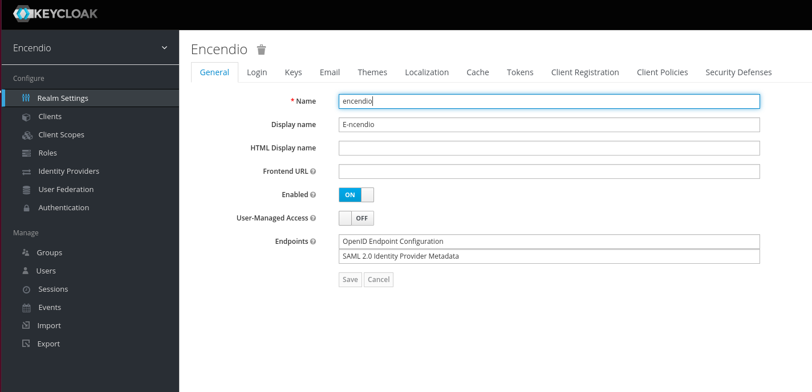

3. **Búsqueda y Selección del Usuario**  
   Dirígete a la sección de "Users" en el menú lateral. En el campo de búsqueda, escribe el correo electrónico del usuario que deseas convertir en administrador y haz clic sobre su nombre para acceder a su perfil.

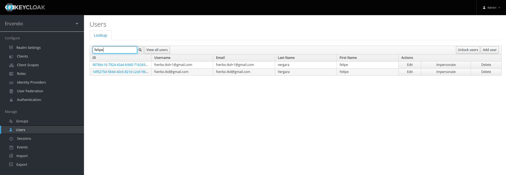

4. **Asignación del Rol de Administrador**  
   En el perfil del usuario, selecciona la pestaña "Role Mappings". En la sección "Client Roles", elige "dashboard" del menú desplegable. Después, selecciona "administradorCrud" de la lista de roles disponibles y haz clic en "Add selected" para asignar el rol al usuario.

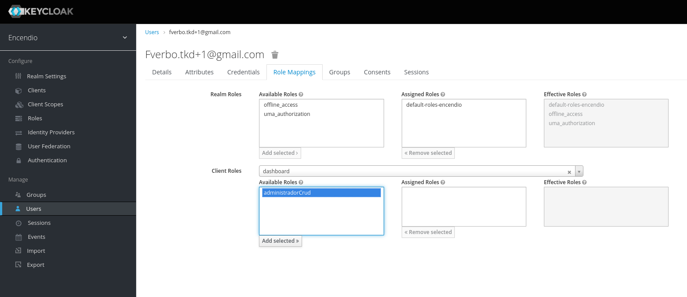

5. **Actualización de los Privilegios del Usuario**  
   Una vez que el rol de administrador ha sido asignado, el usuario deberá cerrar sesión y volver a ingresar para que los cambios surtan efecto.

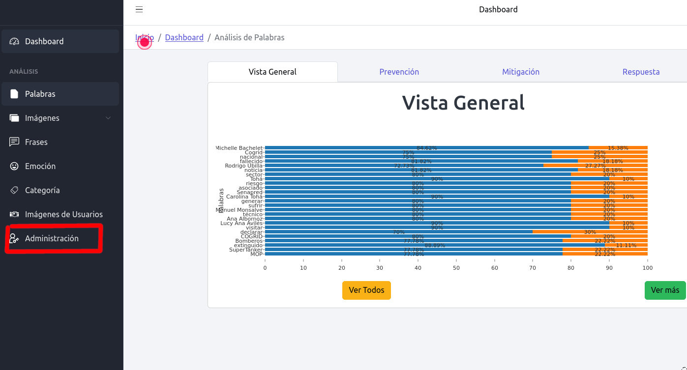

---

### Deshabilitar Administrador

Si es necesario revocar los permisos de administrador de un usuario, sigue los siguientes pasos:

1. **Acceso al Perfil del Usuario**  
   Ingresa nuevamente al panel de Keycloak con las credenciales de administrador. Navega a la sección "Users" y selecciona el usuario al que deseas deshabilitar como administrador.

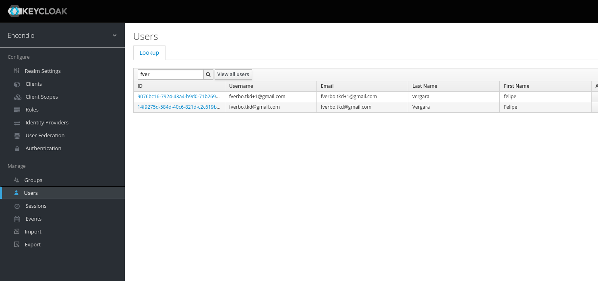

2. **Remoción del Rol de Administrador**  
   En el perfil del usuario, ve a la pestaña "Role Mappings". En "Client Roles", selecciona "dashboard" del menú desplegable. Después, selecciona "administradorCrud" de la lista de roles asignados y haz clic en "Remove selected" para eliminar el rol de administrador del usuario.

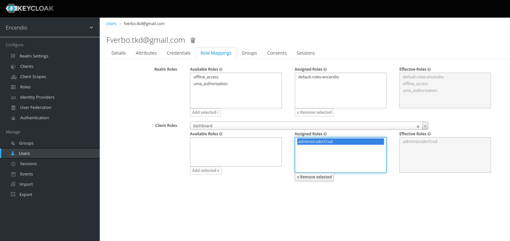

Una vez que el rol ha sido removido, el usuario perderá inmediatamente los privilegios de administrador.

---

### Notas Adicionales

- Asegúrate de que el usuario cierre sesión y vuelva a ingresar después de realizar cambios en sus roles para que los cambios sean efectivos.
- Solo los usuarios con el rol adecuado pueden asignar o revocar permisos de administrador en Keycloak.

## Panel de Administración

El panel de administración es una herramienta integral que te permite gestionar varios elementos relacionados con la plataforma Encendios. A través de este panel, puedes administrar palabras, frases, imágenes, ligas, items, y elementos desactivados de manera eficiente y sencilla.

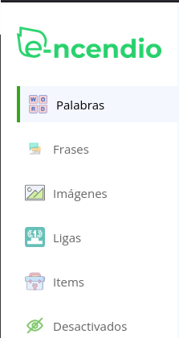

#### Elementos Administrables

1. **Palabras**:  
   En esta sección, puedes realizar las siguientes acciones:

   - **Ver detalles de creación de palabras**: Consulta información sobre cuándo y quién creó una palabra específica.
   - **Última actualización**: Revisa la fecha de la última modificación realizada a una palabra.
   - **Crear nuevas palabras**: Añade nuevas palabras al sistema.
   - **Editar palabras existentes**: Modifica el contenido, significado o atributos de palabras ya registradas.
   - **Ocultar palabras**: Marca palabras para que no sean visibles en la aplicación, sin eliminarlas permanentemente del sistema.

   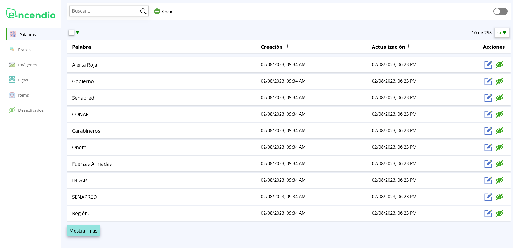

2. **Frases**:  
   La sección de frases te permite:

   - **Visualizar frases existentes**: Revisa todas las frases registradas en la plataforma.
   - **Fechas de creación y actualización**: Consulta las fechas en las que se crearon y actualizaron las frases.
   - **Editar frases**: Realiza cambios en las frases, ya sea en el contenido o en sus atributos.
   - **Ocultar frases**: Similar a las palabras, puedes ocultar frases para que no sean visibles en la aplicación sin eliminarlas.

   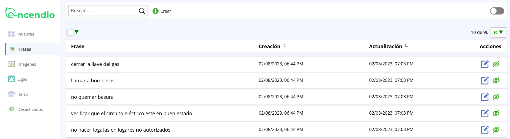

3. **Imágenes**:  
   Desde aquí, puedes gestionar todas las imágenes del sistema:

   - **Visualizar imágenes**: Observa todas las imágenes disponibles en la plataforma.
   - **Crear nuevas imágenes**: Sube imágenes nuevas para su uso en la aplicación.
   - **Editar imágenes**: Modifica atributos de las imágenes, como su descripción o categoría.
   - **Ver detalles de subida**: Consulta quién ha subido cada imagen y en qué categoría se encuentran.
   - **Editar atributos**: Ajusta los atributos asociados a las imágenes, como la categoría, etiquetas, etc.

   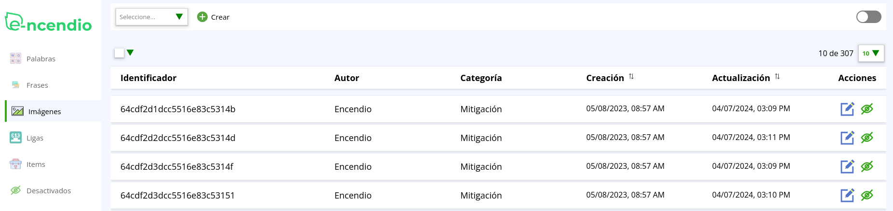

4. **Ligas**:  
   Esta sección está diseñada para la gestión de ligas y rangos:

   - **Definir atributos de liga**: Configura los diferentes atributos necesarios para definir las ligas y los rangos dentro de ellas.
   - **Tamaño de la liga**: Establece el tamaño de cada liga, es decir, cuántos jugadores pueden estar en una liga determinada.
   - **Activar o desactivar ligas**: Habilita o inhabilita ligas según las necesidades del sistema o del juego.
   - **Editar ligas**: Realiza ajustes en las configuraciones de las ligas ya existentes.

   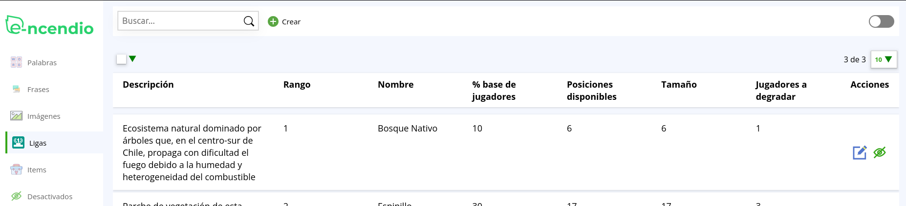

5. **Items**:  
   Administra todos los elementos relacionados con la gamificación:

   - **Crear items**: Añade nuevos elementos de gamificación al sistema.
   - **Editar items**: Modifica las características y atributos de los items ya existentes.
   - **Ocultar items**: Elimina temporalmente items del acceso público sin borrarlos definitivamente.

   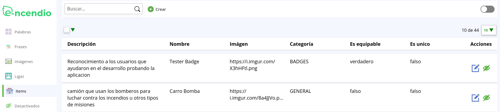

6. **Desactivados**:  
   Esta sección permite visualizar y gestionar los elementos desactivados:

   - **Frases desactivadas**: Muestra todas las frases que han sido ocultadas.
   - **Palabras desactivadas**: Lista de palabras que están desactivadas.
   - **Imágenes desactivadas**: Imágenes que no están visibles actualmente en la aplicación.
   - **Items desactivados**: Items que se encuentran desactivados en el sistema.
   - **Ligas desactivadas**: Muestra todas las ligas que han sido desactivadas.
   - **Reactivar elementos**: Desde esta sección, puedes volver a activar cualquier elemento previamente desactivado, devolviéndolo al estado activo en la aplicación.

   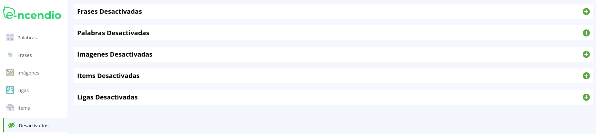

### Notas Importantes

- **Acceso restringido**: Asegúrate de que solo los usuarios con los roles adecuados tengan acceso a las funcionalidades de administración.
- **Cambios en tiempo real**: Los cambios realizados en el panel de administración pueden surtir efecto inmediato, por lo que es importante revisar las modificaciones antes de confirmarlas.
- **Historial de cambios**: Mantén un registro de todas las modificaciones realizadas para facilitar auditorías y revisiones futuras.

Este panel es una herramienta poderosa que permite mantener la plataforma Encendios actualizada, organizada y en buen funcionamiento. Para más detalles o instrucciones específicas sobre el uso del panel de administración, consulta la documentación técnica o comunícate con el equipo de soporte.
