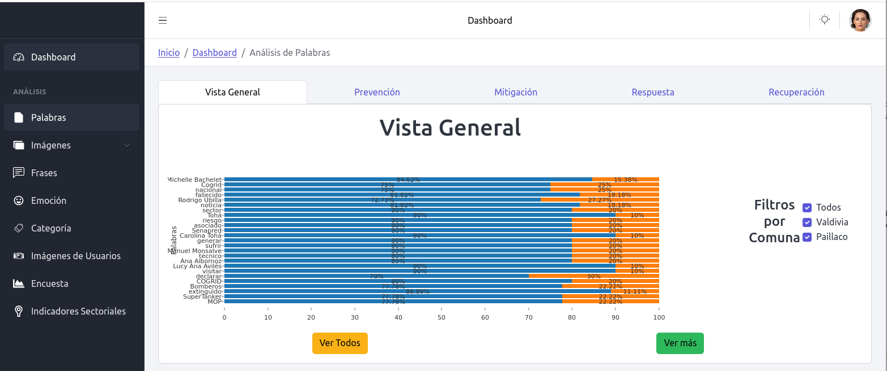
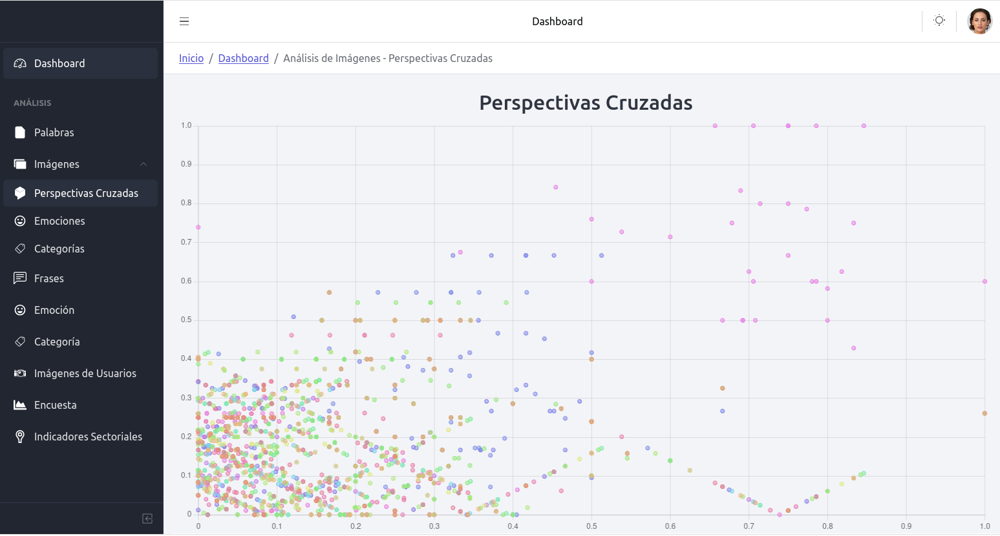
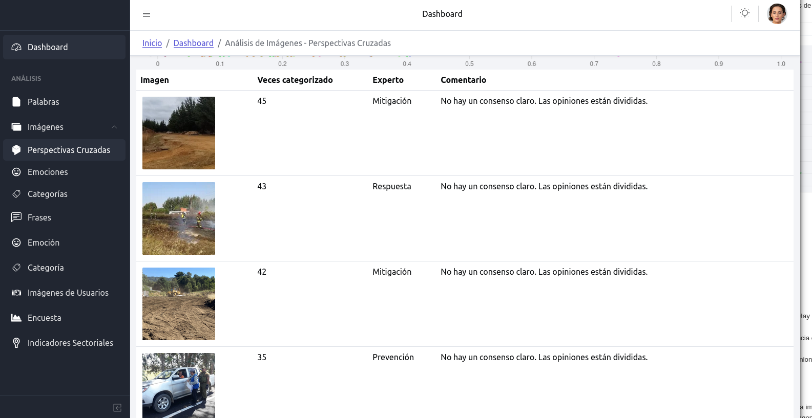
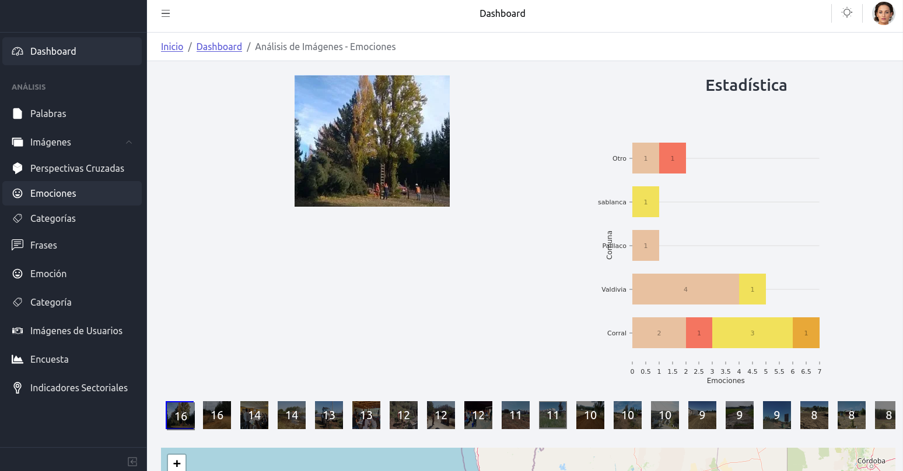
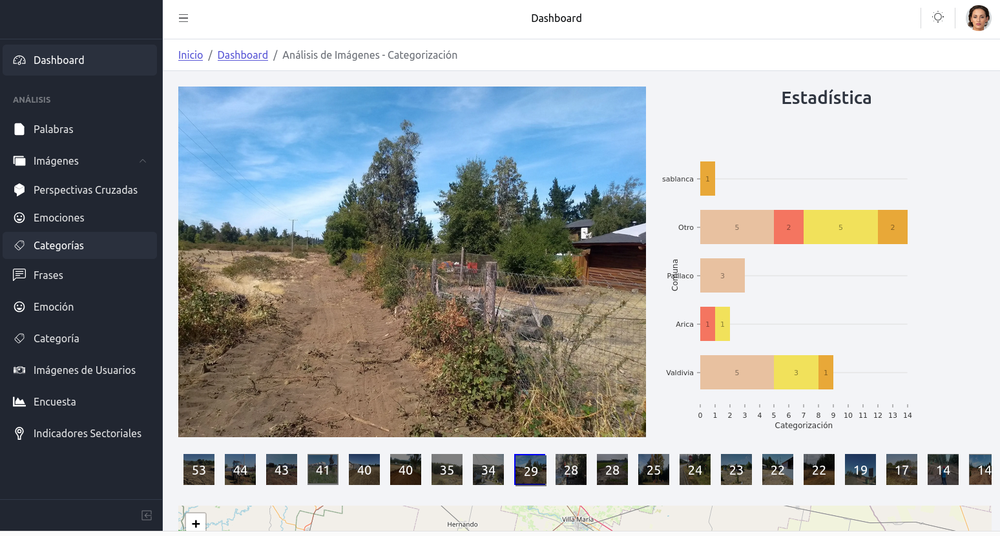
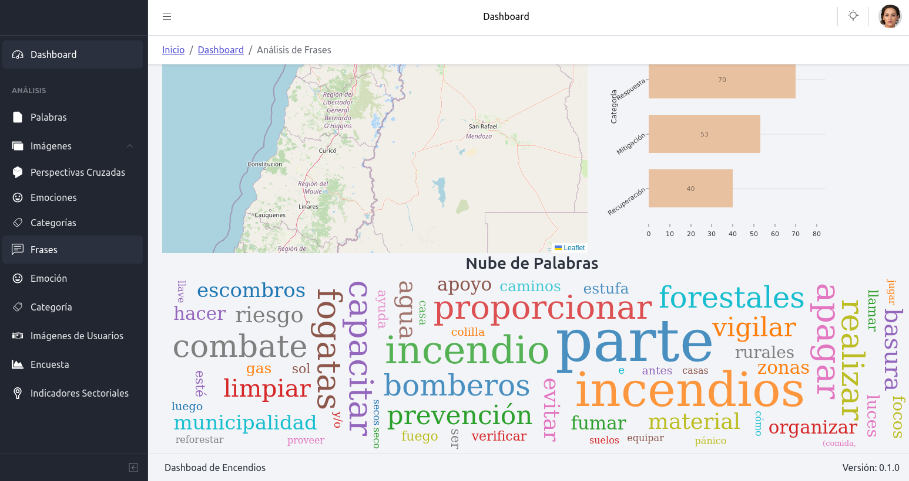
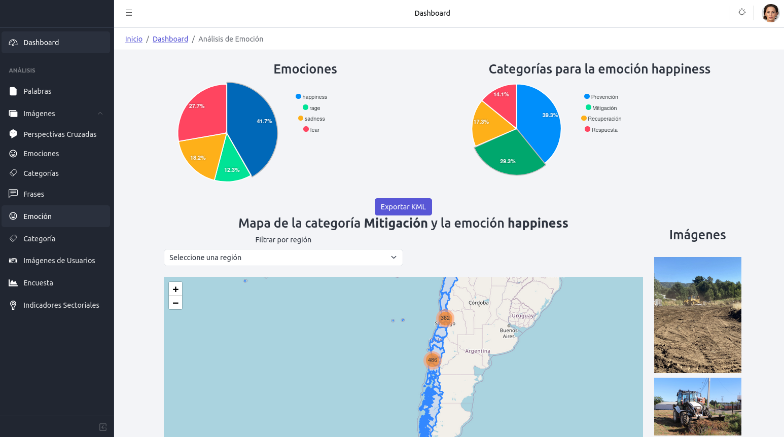
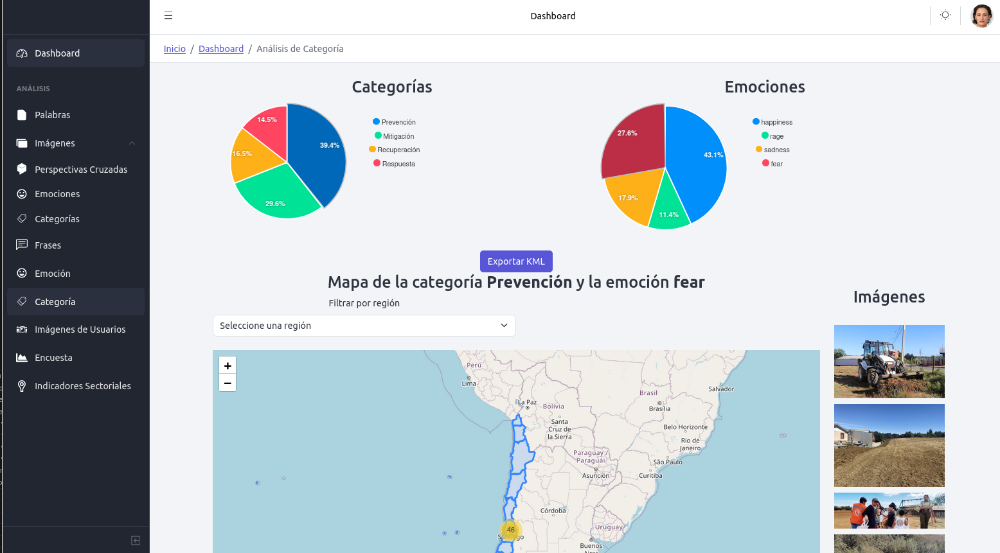
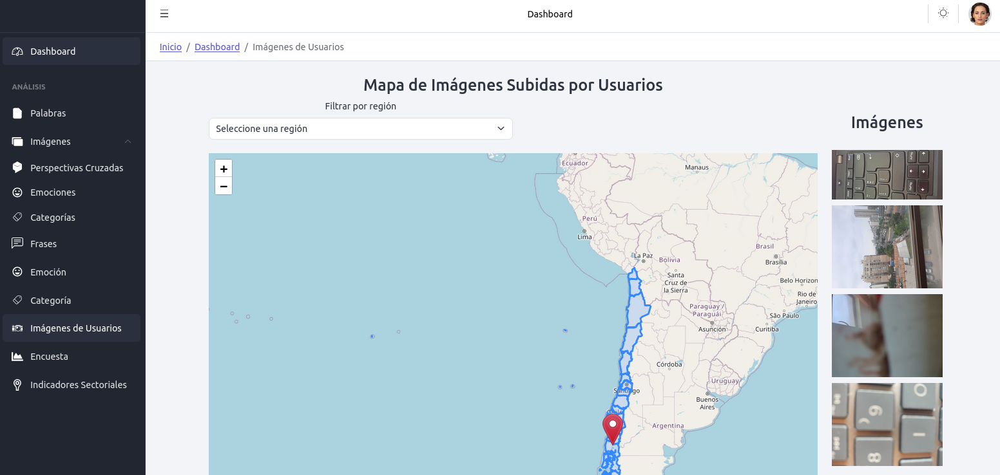
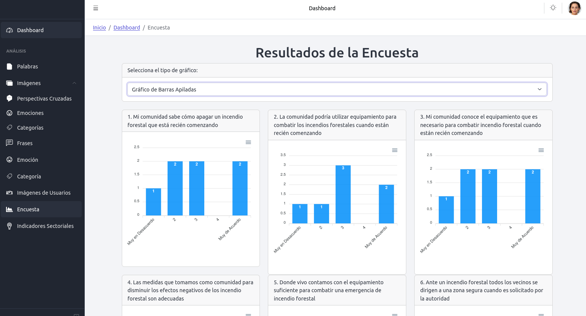

# Documentación **Encendios Dashboard**

Este documento presenta una descripción detallada de las funcionalidades y visualizaciones disponibles en el dashboard de incendios. El propósito del dashboard es permitir el análisis y visualización de diferentes aspectos relacionados con la prevención, mitigación, respuesta y recuperación de incendios forestales, a través de imágenes, datos geográficos y encuestas.

## Menú Principal

El menú del dashboard se compone de los siguientes apartados:

1. **Palabras**
2. **Imágenes**
   - Perspectivas Cruzadas
   - Emociones
   - Categorías
3. **Frase**
4. **Emoción**
5. **Categoría**
6. **Imágenes de Usuarios**
7. **Encuesta**
8. **Indicadores Sectoriales**

### 1. Palabras

En esta sección, se pueden explorar las palabras clave asociadas a incendios, clasificadas por categorías tales como prevención, mitigación, respuesta y recuperación. Aquí el usuario podrá filtrar las palabras dependiendo del contexto que desee analizar.

### 2. Imágenes

El menú de imágenes incluye tres subapartados:

#### a. Perspectivas Cruzadas

Esta sección utiliza un gráfico de **perspectivas cruzadas** basado en la técnica de **NMDS** (Non-Metric Multidimensional Scaling). Se presenta una visualización de cómo las diferentes categorías de incendios y respuestas se relacionan entre sí, permitiendo un análisis comparativo.

Acompañando este gráfico, se encuentra una tabla con la siguiente información:

- **Imagen**: Identificación de la imagen.
- **Veces categorizado**: Cuántas veces ha sido categorizada por los usuarios.
- **Categoría asignada por experto**: Clasificación otorgada por un experto.
- **Comentario**: Ejemplo de comentarios en la tabla:
  - "No hay un consenso claro. Las opiniones están divididas."
  - "Hay un claro consenso con el experto."

El análisis de consenso sigue estas reglas:
- Si la categoría con más votos es mayor o igual al 50% y coincide con la del experto: "Hay un claro consenso con el experto."
- Si la categoría con más votos no coincide con la del experto: "Hay una clara discrepancia con el experto. La mayoría opina distinto."
- Si ninguna categoría alcanza el 50% de los votos: "No hay un consenso claro. Las opiniones están divididas."

#### b. Emociones

En esta parte del dashboard se visualizan imágenes categorizadas según emociones. Cada imagen está geolocalizada, mostrando en qué comuna se tomó la foto y qué emoción se asoció a la imagen.

Las emociones se traducen de la siguiente manera:

- **Happiness**: Felicidad
- **Sadness**: Tristeza
- **Fear**: Miedo
- **Rage**: Enojo

Se incluye un mapa que refleja la ubicación geográfica de las emociones capturadas en imágenes.

#### c. Categorías

Similar al apartado de emociones, esta sección permite explorar las imágenes según las categorías relacionadas con los incendios. Las categorías disponibles son:

- Prevención
- Mitigación
- Respuesta
- Recuperación

### 3. Frase

Se genera una **nube de palabras** basada en la ubicación geográfica y las imágenes que caen dentro del área seleccionada. Esta nube visualiza las palabras más frecuentes asociadas con las imágenes.

### 4. Emoción

Permite realizar un análisis detallado de las emociones presentes en las imágenes. El usuario puede seleccionar una emoción específica, y el dashboard mostrará las imágenes relacionadas y su respectiva categorización. La visualización principal es un mapa que muestra la distribución geográfica de las emociones, acompañado de una galería lateral de imágenes.

### 5. Categoría

Este apartado invierte el análisis de "Emoción". Aquí, se comienza seleccionando una categoría específica (por ejemplo, "Prevención"), para luego observar las emociones relacionadas con esa categoría. Como en el apartado anterior, se muestra un mapa con las imágenes categorizadas y una galería lateral.

### 6. Imágenes de Usuarios

Se muestran todas las imágenes subidas por los usuarios, con su respectiva geolocalización. Esta funcionalidad permite a los usuarios visualizar las contribuciones de la comunidad en relación a los incendios forestales.

### 7. Encuesta

En esta sección, el usuario puede visualizar los resultados de una encuesta aplicada a las comunidades. La visualización puede ser en formato de gráfico de barras, caja de bigotes o mapa de calor. La encuesta aborda una escala de Likert y contiene preguntas relacionadas con la capacidad de la comunidad para responder a los incendios forestales. Algunas de las preguntas incluyen:

1. Mi comunidad sabe cómo apagar un incendio forestal que está recién comenzando.
2. La comunidad podría utilizar equipamiento para combatir los incendios forestales cuando están recién comenzando.
3. Mi comunidad conoce el equipamiento necesario para combatir un incendio forestal.
4. Las medidas que tomamos como comunidad para disminuir los efectos negativos de los incendios forestales son adecuadas.

...y así hasta 39 preguntas que abarcan diversos aspectos de la prevención, respuesta y recuperación de incendios forestales.

### 8. Indicadores Sectoriales

Esta sección proporciona un análisis detallado de los indicadores sectoriales relacionados con incendios forestales. La información se muestra por comuna, mostrando el **consenso** y la **precisión** de los usuarios en función de la categorización de las imágenes, tanto de los usuarios como de los expertos.

El dashboard genera un resumen visual que facilita la comparación entre distintas comunas y su nivel de preparación y respuesta frente a incendios.
