### Documentación para Desarrolladores del Proyecto EncendiosMobile React Native

#### Índice

1. [Introducción](#introducción)
2. [Estructura del Proyecto](#estructura-del-proyecto)
3. [Configuración del Entorno de Desarrollo](#configuración-del-entorno-de-desarrollo)
4. [Uso de Scripts y Comandos](#uso-de-scripts-y-comandos)

---

### Introducción

**EncendiosMobile** es la aplicación móvil desarrollada en React Native para la plataforma Encendio. Esta aplicación proporciona una experiencia de usuario nativa en dispositivos móviles tanto para iOS como para Android, permitiendo a los usuarios interactuar con las funciones clave de Encendio desde sus teléfonos móviles.

### Estructura del Proyecto

La estructura del proyecto está organizada de la siguiente manera:

```
.
├── android/
│   ├── app/
│   ├── build.gradle
│   └── ...
├── ios/
│   ├── encendiosMobile/
│   ├── Podfile
│   └── ...
├── src/
│   ├── App.tsx
│   ├── auth/
│   ├── common/
│   ├── games/
│   ├── home/
│   ├── inventory/
│   ├── league/
│   ├── login/
│   ├── main/
│   ├── permissions/
│   ├── politics/
│   ├── profile/
│   ├── settings/
│   ├── shared/
│   ├── tasks/
│   └── types/
├── __tests__/
│   └── App.test.tsx
├── app.json
├── babel.config.js
├── index.js
├── jest.config.js
├── metro.config.js
├── package.json
└── tsconfig.json
```

- **android/**: Carpeta específica para configuración y código de la plataforma Android.
- **ios/**: Carpeta específica para configuración y código de la plataforma iOS.
- **src/**: Carpeta principal que contiene todo el código fuente del proyecto en React Native.
- \***\*tests**/\*\*: Carpeta que contiene las pruebas de la aplicación.
- **package.json**: Archivo de configuración de Node.js que gestiona las dependencias y scripts.
- **babel.config.js**: Configuración de Babel para la transpilación de JavaScript.
- **metro.config.js**: Configuración de Metro, el empaquetador de módulos de React Native.

### Configuración del Entorno de Desarrollo

1. **Instalación de dependencias**:
   Ejecuta el siguiente comando para instalar todas las dependencias del proyecto:

   ```bash
   npm install
   ```

   o

   ```bash
   yarn install
   ```

2. **Configuración de Entorno**:
   Asegúrate de tener un archivo `.env` configurado basado en `.env.develop`. Este archivo debe contener las variables de entorno necesarias para la configuración del proyecto.

3. **Iniciar la aplicación en un emulador o dispositivo**:
   - Para Android, utiliza:
     ```bash
     npm run android
     ```
   - Para iOS, utiliza:
     ```bash
     npm run ios
     ```

### Uso de Scripts y Comandos

Los scripts disponibles se definen en el archivo `package.json` y son los siguientes:

- **`npm run android`**: Inicia la aplicación en un emulador o dispositivo Android.
- **`npm run ios`**: Inicia la aplicación en un simulador o dispositivo iOS.
- **`npm run lint`**: Ejecuta ESLint para verificar el código.
- **`npm run start`**: Inicia el servidor de desarrollo de React Native.
- **`npm run start:ios`**: Inicia la aplicación en un simulador específico de iOS.
- **`npm run test`**: Ejecuta las pruebas unitarias con Jest.

### Vistas de la aplicación

Al iniciar la aplicación, se te pedirá que inicies sesión, ya que es necesario tener una cuenta para poder usarla.

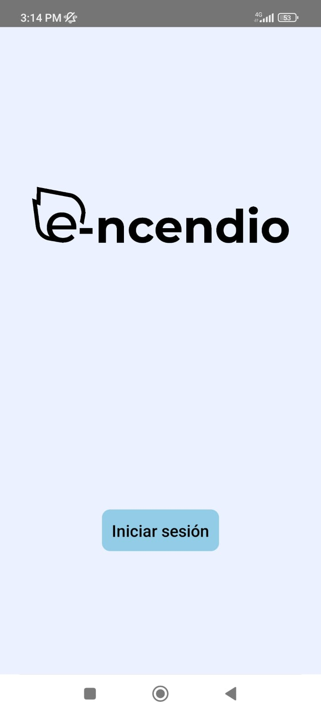

Después de hacer clic en el botón de inicio, podrás utilizar una cuenta existente.

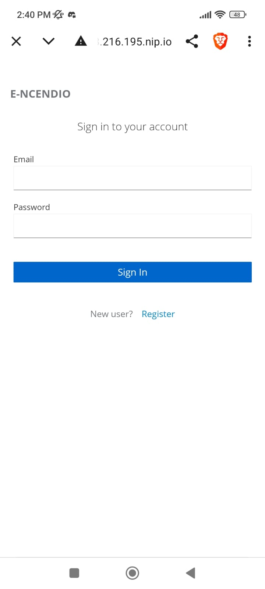

O, si no tienes una cuenta, podrás registrarte.

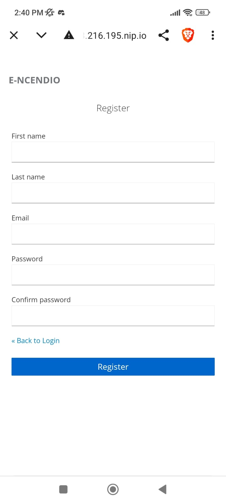

Una vez iniciada la sesión, tendrás acceso a una serie de juegos.

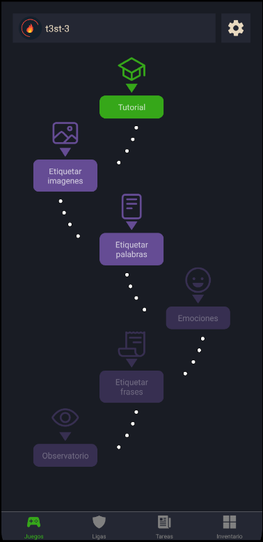

Cada uno de los juegos ofrece diferentes características:

- Seleccionar la opción más adecuada.
- Subir una imagen.

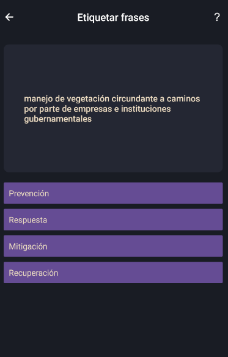

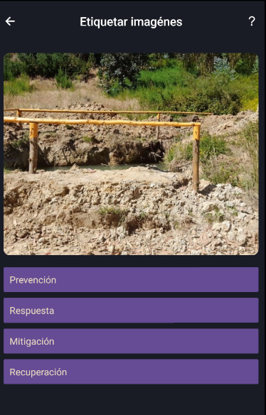

Cada juego incluye un botón con un signo de interrogación que muestra la definición de las categorías.

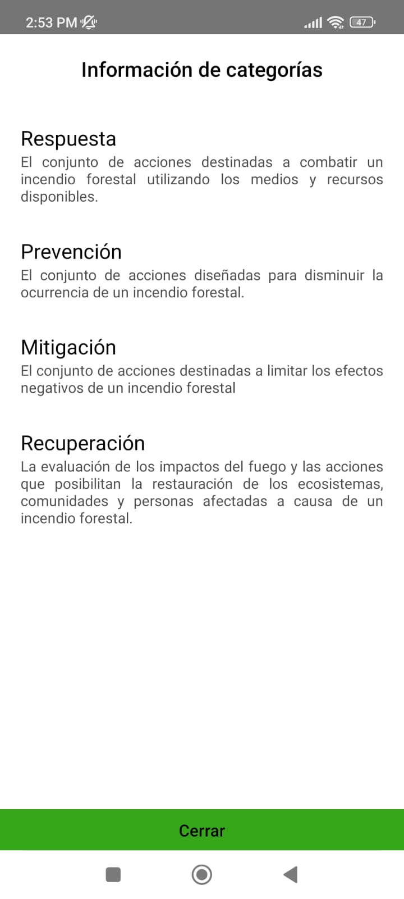

Volviendo a la pantalla principal, puedes acceder a la configuración del usuario haciendo clic en el icono de la tuerca. Si seleccionas la imagen del usuario, podrás cambiarla por otras opciones disponibles.

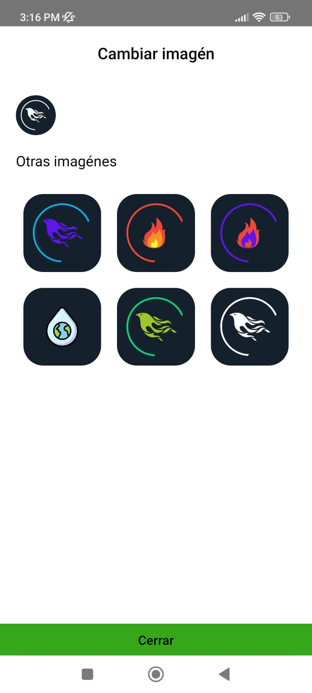

En el menú, si haces clic en el botón "Ligas", podrás ver en qué liga te encuentras, tu posición actual, y los compañeros que están en la misma liga.

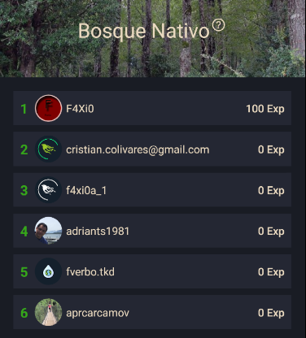

Por último, si seleccionas el botón "Tareas", verás tu progreso semanal.

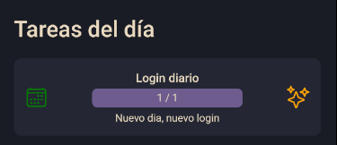

Cumplir misiones te permitirá subir de liga y obtener nuevas recompensas, que se almacenarán en tu inventario.

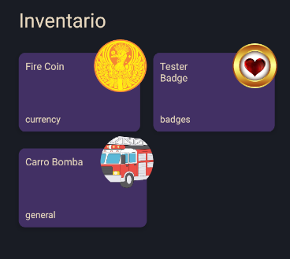
